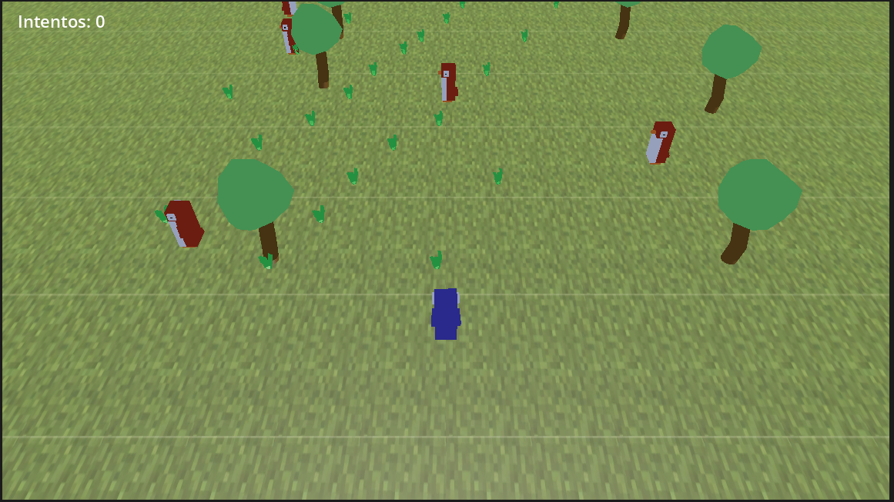

## 🐧 El Personaje: Penqüi

**Penqüi** es un pingüino de aspecto robusto y carácter curioso, modelado en Blender con colores vibrantes que lo hacen inconfundible. Su cuerpo rechoncho no le impide moverse con agilidad — siempre y cuando evites que los otros pingüinos te aplasten.

Penqüi no habla, no salta, no vuela. Solo camina. Y eso, en este mundo, es suficiente para sobrevivir... o no.

---

## 🎮 Controles

| Tecla | Acción |
|-------|--------|
`↑` | Avanzar |
`↓` | Retroceder |
`←` | Moverse a la izquierda |
`→` | Moverse a la derecha |

> El personaje se orienta automáticamente hacia la dirección de movimiento.

---

## 🤖 Los NPCs: La Manada

El escenario está lleno de **pingüinos autónomos** que patrullan de un extremo al otro.

Hay **5 NPCs** activos organizados en carriles horizontales, cada uno con su propia personalidad de velocidad:

| NPC | Carril (Z) | Velocidad | Carácter |
|-----|-----------|-----------|----------|
| Patrullero 1 | -4 | 4.0 u/s | El ansioso — siempre apurado |
| Patrullero 2 | -6 | 2.5 u/s | El tranquilo — pero constante |
| Patrullero 3 | -8 | 3.0 u/s | El metódico — ni rápido ni lento |
| Patrullero 4 | -10 | 3.5 u/s | El decidido — sabe lo que quiere |
| Patrullero 5 | -12 | 4.5 u/s | El caótico — el más peligroso |

### Comportamiento

Cada NPC se desplaza en **línea recta de izquierda a derecha** dentro de su carril, rebota al llegar al extremo y regresa. La detección de colisión es **omnidireccional** — si Penqüi toca a cualquier patrullero por cualquier lado, vuelve al inicio.

---

## 📸 Captura de Pantalla

---
